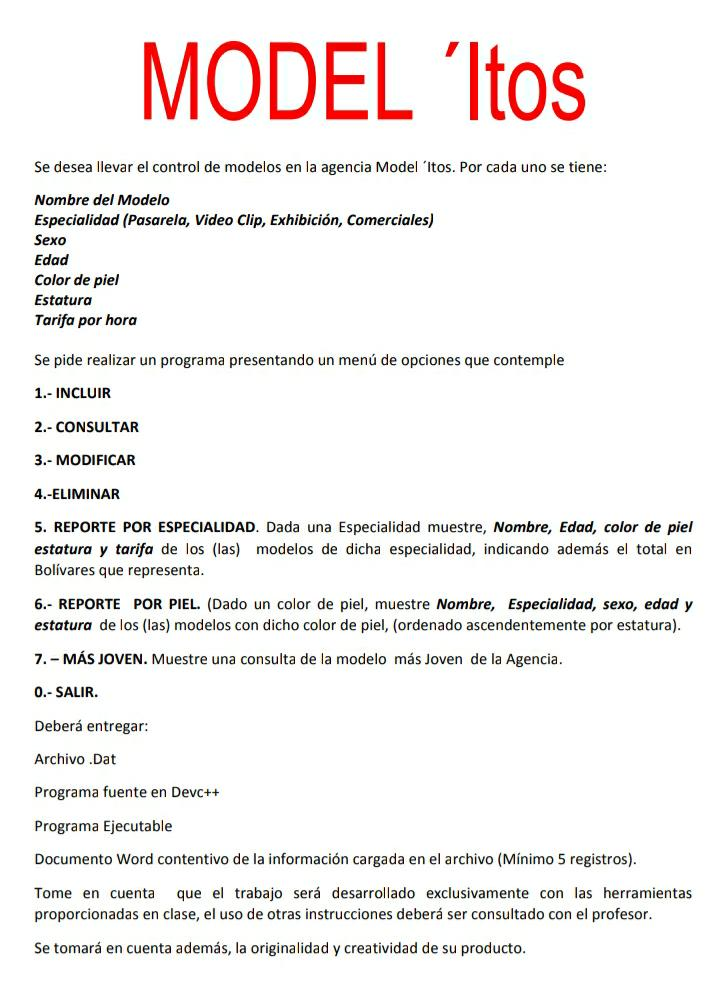

# Archivos Binarios en Lenguaje C

Ejemplo de operaciones CRUD (create-read-update-delete) en archivos binarios en lenguaje C.

Programa simple para una agencia de modelaje ficticia como parte de una asignación universitaria.

# Planteamiento

# Datos previamente cargados

# Compilación

Ejecutar comando:
`gcc -o agencia main.c`
